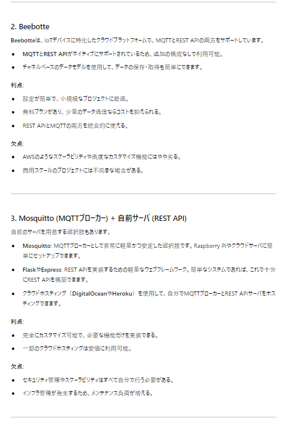
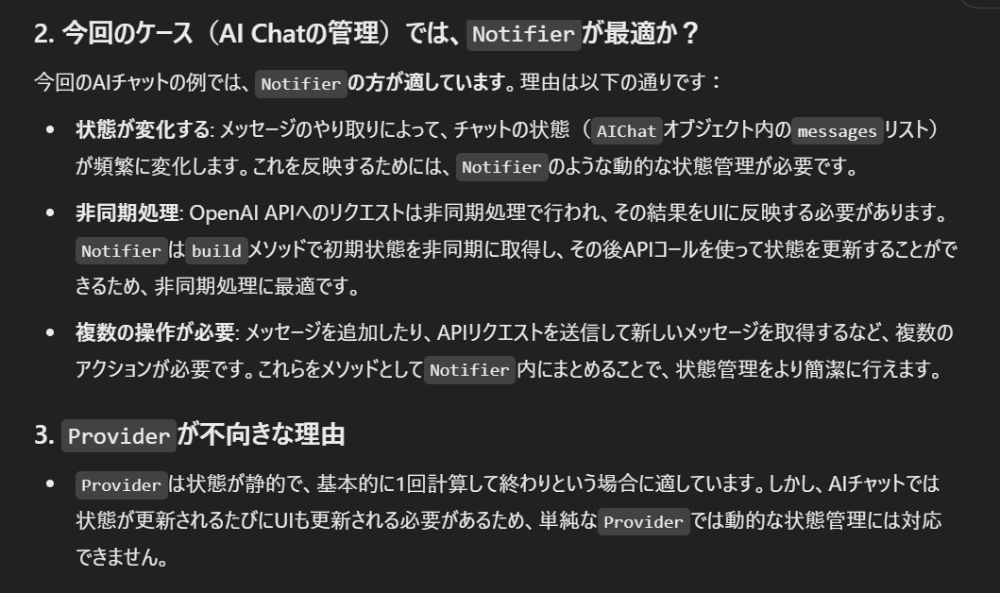
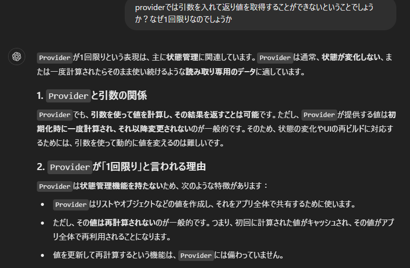
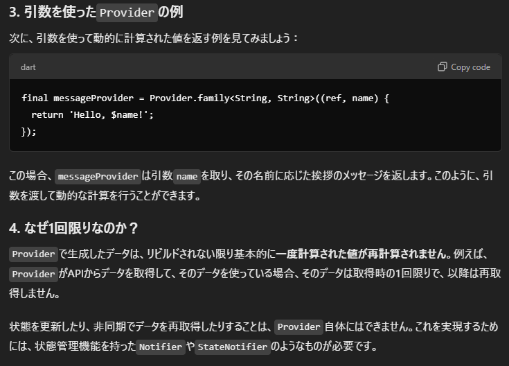
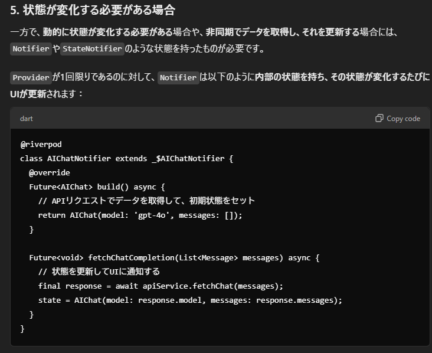
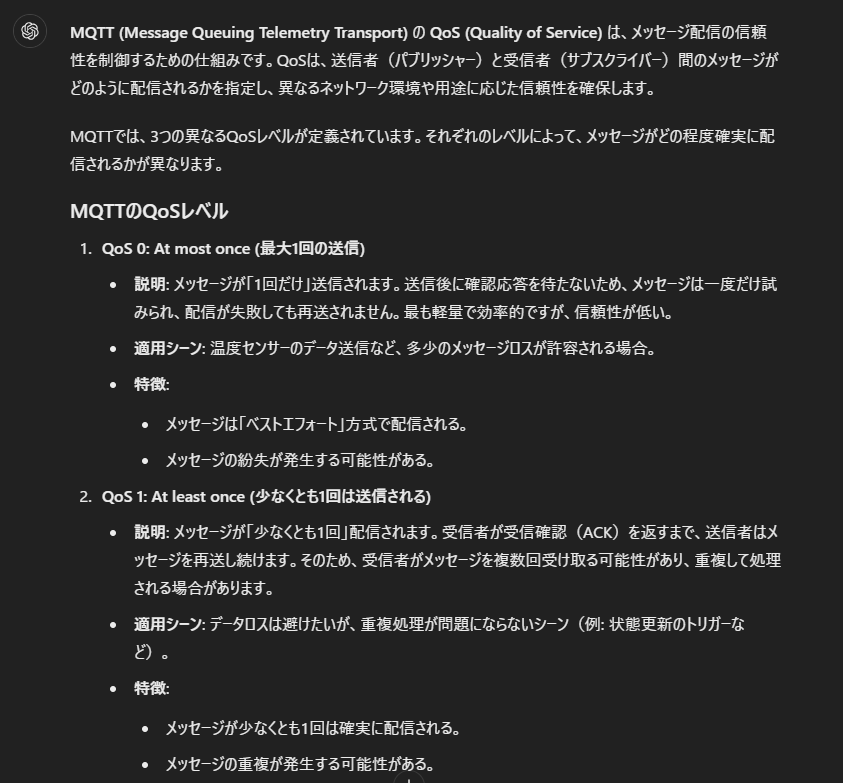
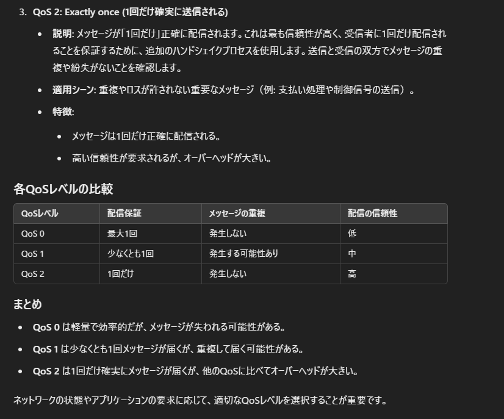
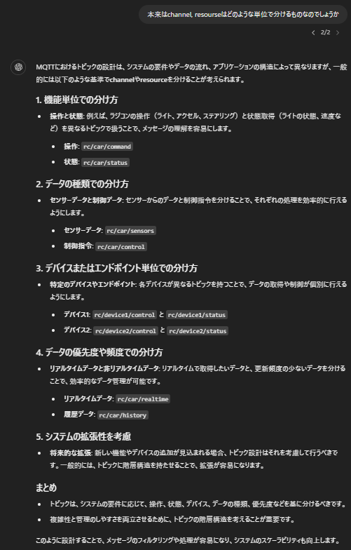
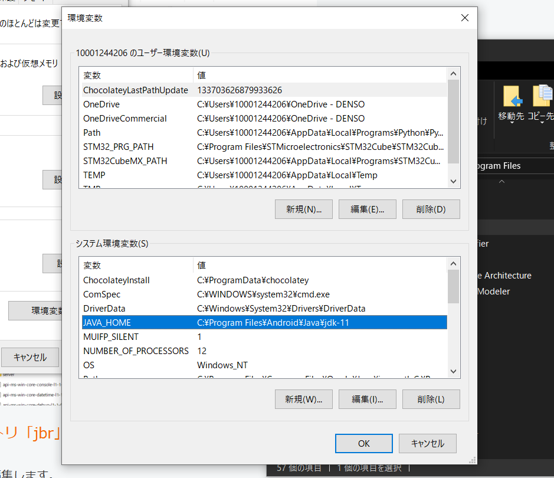

# 240824
## class Map()の作成
始めはFlutterのプラグインページを参考に進めたが、サンプルコードのエラーがでたので、別のページを参照した。
APIキーを取得してFlutterのManifestFileへの設定、Flutterのgoogle_mapプラグインのimportなどが必要
https://pub.dev/packages/google_maps_flutter

以下を参照して、2-3の現在地取得までのコードを利用した
https://qiita.com/my_programming/items/26b9ac6f0d2b3d1bd766#2-3%E5%9C%B0%E5%9B%B3%E3%81%A7%E7%8F%BE%E5%9C%A8%E5%9C%B0%E3%82%92%E5%8F%96%E5%BE%97%E3%81%99%E3%82%8B%E3%81%9F%E3%82%81%E3%81%AE%E3%82%B3%E3%83%BC%E3%83%87%E3%82%A3%E3%83%B3%E3%82%B0

デバッグするとエラーが出て、android/settings.grandleのKotlinのバージョンアップが必要だった。

デバッグ実行時のエラーはでなくなったが、地図が画面に表示されない

```error
======== Exception caught by gesture ===============================================================
The following LateError was thrown while handling a gesture:
LateInitializationError: Field 'mapController' has not been initialized.
```
おそらくAndroidStudioを再起動することでバグ解消され、実行できた

## 位置情報アクセスのパーミッション取得
パーミッション要求の方法は、位置情報に特化したもの（GeolocatorのIF）と、汎用的に使えるものがある。
今後も必要になるので、汎用的に使える方を実装する


https://zenn.dev/slowhand/articles/f4e4e092f9b72b
https://zenn.dev/attomicgm/articles/about_android_foreground_location_permission

# 240827
## APIキーをgit非公開にする方法を追加
以下を参照した。android/local.propertiesに環境変数を設定し、android/app/build.gradleでプレイスホルダーに設定する。
https://www.entwicklernotizen.de/blog/how-to-handle-secret-api-keys-in-flutter-for-android-and-i-os/
https://dev.to/no2s14/hide-your-api-keys-from-your-android-manifest-file-with-flutter-using-local-properties-3f4e

さらに、上記では以下のエラーが発生した。
requires a placeholder substitution but no value for <applicationName> is provided.
→以下を参考に、manifestPlaceholders += [...]とした。
https://stackoverflow.com/questions/70906879/attribute-applicationname-at-androidmanifest-xml59-42-requires-a-placeholder

このままではgit公開されるので、android/.gitignoreに、/local_maps.propertiesを記載した

# 240901
## 位置情報アクセスのパーミッション取得の実装
以下を参考に実装を進める。（Flutterのパーミッション要求の例はあまり見つからなかった）
問題：一度、don't allowを選択すると、ずっとパーミッション要求のポップアップが出てこず詰まってしまった。
→エミュレータの設定アプリからパーミッションを毎回要求するように設定変更が必要
https://medium.com/@dudhatkirtan/how-to-use-permission-handler-in-flutter-db964943237e

# 240915
## ラズパイとスマホアプリの通信方法の検討
### システム構成の結論
  * ラズパイーサーバ：MQTT
    * ブローカーとして無料サーバのbeebotteを使用する
    * beebotteはMQTTサーバ、REST APIの使用が可能、無料、AWSよりも簡単
  * サーバースマホアプリ：REST API
  
  
  

### beebotteの動作確認
コマンドプロンプトからcurlコマンドにより、RESTとPubSubの動作確認を行う
https://gist.github.com/yoggy/28196ba084f9c406c75967289fbb3dca
https://beebotte.com/docs/write

#### REST API
##### Read
```curl -H "Content-Type: application/json" -H "X-Auth-Token: token_xxxxxxxxxxxx" -X GET http://api.beebotte.com/v1/data/read/REST_API_TEST/beebotte_test```

##### Write
* windowsではシングルクオーテーションを使えない、Jsonの中でダブルクオーテーションを使うときは\"にするという注意が必要。ここで1時間くらい詰まった
https://qiita.com/tocoteron/items/291b463e45f422abd425#comments

```curl -H "Content-Type: application/json" -H "X-Auth-Token: token_xxxxxxxxxxxx" -X POST http://api.beebotte.com/v1/data/write/REST_API_TEST/beebotte_test -d "{\"data\":\"hello\"}"```


#### Pub/Sub
* subscribeはコマンド上ではできないので、publishだけテストする
```curl -H "Content-Type: application/json" -H "X-Auth-Token: token_xxxxxxxxxxxx" -X POST http://api.beebotte.com/v1/data/publish/REST_API_TEST/beebotte_test -d "{\"data\":\"hi\"}"```


次回は以下のチュートリアルに倣って、ラズパイからのpublishをテストする
https://beebotte.com/tutorials/monitor_humidity_and_temperature_with_raspberrypi

# 0929
## openAIのAPIを使ってChatアプリを作ってみる
openAIのAPIキーを発行する
https://platform.openai.com/settings/profile?tab=api-keys

REST APIによりJsonでやり取りができる

APIキーをGoogleMapの時と同じようにproperties, build.gradle, gitignore, manifestに記載する

manifest.xmlからメタデータを取得する方法
https://stackoverflow.com/questions/38687159/what-is-metadata-and-what-is-the-use-of-it-in-android
https://puyooboe.blogspot.com/2013/08/androidmanifestxml-meta-data.html
https://flutterawesome.com/flutter-get-android-meta-data-in-androidmanifest-xml/
→ Androidネイティブコード側の MainActivity.ktまで見ないと行けなさそう。。。
→上記のやり方ではなく、環境変数でAPIキーを登録する方法の方が簡単そうだったので、環境変数を使用
https://medium.com/@akhil-ge0rge/hiding-secret-keys-in-your-flutter-app-fea9d60e9eb8
https://flutterawesome.com/flutter-get-android-meta-data-in-androidmanifest-xml/


# 1005
## API取得と画面を切り分ける、リファクタリングを行う
今後、MQTTでデータ送信・取得なども増えてくるので、今のうちに、OpenAPIでリファクタリングをトライする
https://medium.com/@raphaelrat_62823/consuming-rest-api-in-flutter-a-guide-for-developers-2460d90320aa

上記はREST APIで取得したデータをどう表示するか、ということには役立つが、画面上のインタラクションをどう処理するかについては、微妙そう。

以下のアーキテクチャが、小規模開発でシンプルでよいかも
https://pentagon.tokyo/app/2937/

# 1009
riverpodでprovider or notifier
状態を変化させるものはnotifierで関数を用意して行う。今回はチャットするたびにresponseを変えるのでnotifierの方が良いよう





# 1014
以下のビルドエラーの対応
Could not find method implementation() for arguments [com.android.support:support-annotations:
以下の定義をandroid/build.grandleではなく、android/app/build.grandleに定義するように変更
https://stackoverflow.com/questions/71879668/i-am-getting-gradle-task-assembledebug-failed-with-exit-code-1

dependencies {
  implementation 'com.android.support:support-annotations:28.0.0'
}

## MQTTをFlutterで実装
以下を参考に、pub/subを実装してテストする
https://github.com/shamblett/mqtt_client/blob/master/example/mqtt_server_client.dart
MQTTのQoSは1とする



家のWifiだとファイアウォールかなにかで、beebotteのサーバにアクセスできなかったので、テザリングで実施。
ラズパイ側は、pahoのライブラリを使ったサンプルプログラムを使い、ラズパイとスマホアプリで通信できることを確認した。
https://beebotte.com/docs/mqtt#example

MQTTはWebシミュレータではサポートしておらず、動かないのでAndroidStudioのエミュレータで実行する必要がある

## MQTTのTopic/Messageのデータ構造
Topicはchannel/resourceにより指定し、messageはStringで送る
結論
* channel/resource: LC500/command, LC500/status
* message: 以下のようなJson
  * message = {"accelerate": 10, "steer": 30, "light":"on"}

参考


## MQTTSeviceのProviderをriverpodで用意する
MQTTServiceをアプリ内で一つのインスタンスとして、各画面に渡すため、また、画面とPub/Subロジックを切り分けるため、riverpodを用いる。

## 今後問題になりそう：main.dartのProviderScopeでriverpodのプロバイダがインスタンス化されない
providerScopeでインスタンス化され、connectを実行することで、アプリ起動中は接続を保持するようにしたかったが、connectが実行されておらず、
画面に入ったときに最初にインスタンス化してconnectを実行する必要がある？
画面自体がインスタンス化されていないためか？main.dartでwatchするなどしてインスタンス化すれば解決できるのか？
アプリ起動中に画面切り替えても状態を保持するように、インスタンス化を最初に行うように変更すべき（別の問題）
→ IndexedStackを用いて画面を保持するように変更
→ main.dartで空のウィジェットを作り、providerの初期化を行うように変更

# 1019
## status_checkでのsubscribe
riverpodのwatch, listen, readの使い分け
https://riverpod.dev/docs/concepts/reading

# 1027
## riverpodのwatch, read, listenの使い分け
https://medium.com/@jacatanog/ref-read-ref-watch-and-ref-listen-in-riverpod-2-18a1ef598ee5
## consumerウィジェットの使い方
一部のUIだけrebuildしたい場合に使う
https://zenn.dev/kiiimii/articles/96d5dc181228b2

# 1101
## エミュレータで実行失敗するエラー
症状：黒い画面になったり、画面がギザギザになってバグる

以下の方法でビルドエラーの原因を探る
https://qiita.com/ikemura23/items/28cc9e30029200ee3b92

原因はJavaのバージョンにFlutterのパッケージが対応していないものがあること。
以下の方法でJava11へダウングレードする
https://flutter.salon/error_warning/change-java-home/

android/grandlew.bat
before
```
:findJavaFromJavaHome
set JAVA_HOME=%JAVA_HOME:"=%
set JAVA_EXE=%JAVA_HOME%/bin/java.exe
```
after
```
set JAVA_HOME="C:\Program Files\Microsoft\Java\jdk-11"
```

上記のようにしてもうまくいかなかった
→システム環境変数に追加することに変更
https://datdevelopment.main.jp/develop/flutter/flutter308/


# 1104
## ステア操作をジョイスティックから三角ボタンへ変更
ステア用モータもDCモータであり、ジョイスティックで角度を制御することができない。
ジョイスティックだとゼロ点に戻しても、モータ角は戻らない。ゼロ点に戻すには逆方向に操作する必要があるなどの違和感がある。
また、駐車のためのモータ逆操作のときもどれだけ戻すかの計測が難しいし、ずれやすそう。
これらの理由から、ステア操作は三角ボタンにする。

# 1106
## Android Studioの再インストール
実行がうまくできず、画面が暗くなって終了する不具合が解決できなかったので、Android Studio を再インストールする。キャッシュを消したりしても治らず、同様の症状はあるようなので、再インストールしてみる。
ここら辺の方法の普通のアンインストール方法がうまくいかないので、
https://codeforfun.jp/how-to-completely-uninstall-android-studio/
手動で該当フォルダを削除する
https://plaza.rakuten.co.jp/acotawa/diary/202303020000/
https://m-millefeuille.hatenablog.com/entry/20210818/1629252530
https://qiita.com/ydty/items/0a328021172a8f3d6dae

インストール方法
https://zenn.dev/heyhey1028/books/flutter-basics/viewer/getting_started_windows

インストール後に実行すると、javaバージョンとgrandleバージョンの互換性が違うというエラーが出たので、エラーの解決方法に従い、以下を進めた
https://docs.flutter.dev/release/breaking-changes/android-java-gradle-migration-guide
https://docs.gradle.org/current/userguide/compatibility.html#java


# 1107
## JDKバージョンのエラーがまた出た
以下に従い再度Javaのバージョンダウングレードを実施


flutter config --jdk-dir "C:\Program Files\Microsoft\Java\jdk-11"

jdk21に戻す場合（AndroidLicencesの同意に必要だった）
flutter config --jdk-dir "C:\Program Files\Microsoft\jdk-21.0.2.13-hotspot"

javaとgradleの互換性表
https://docs.gradle.org/current/userguide/compatibility.html#java

# 1108
## 再インストールして同じプロジェクトで実行してもだめだったので、新しくプロジェクト作成して、コピペした
コピペしただけなので中身は変わってないはずなのにうまくいった。

# 1109
## スマホ実機での確認
wifi, usb接続, apk直接インストールの3種類がある。
usbはつなげない。wifiは自宅Wifiのファイアウォールかなにかがまた原因だと思うができなかった。apkのGoogleDrive経由でインストールでできた
https://yowayowa-engineer.com/run-device-apk/

## openaiAPIのfunctionCallingを調べた。
やることごとにMQTTのデータを送るための関数を用意して、それをfunctionに入れればできそう

## AAOSの自宅での確認
会社ではできたのに自宅では起動しない。
電源が足りない問題か。プラグは同じだけど。。。ディスプレイ対応とかもあるかも？
電源問題対処のため以下に従ってGPIOで5V3A供給したけどうまくいかない。
とりあえず5V4Aのプラグを購入したのでそれで試してみる
https://synrock-tech.com/hardware/single_board/raspberry-pi_power_supply_gpio/

# 1119
## イルミのダイアログでマニュアル操作をしたときにOFF/Autoボタンの色を変化させて停止されたことが分かるようにしたい
alertdiaglogなどのウィジェットではこれができない
画面外でsetStateをしても再ビルドがされない
→ModalRouteを継承したカスタム画面を作る必要がある。
→細かいUIなので一旦スキップする